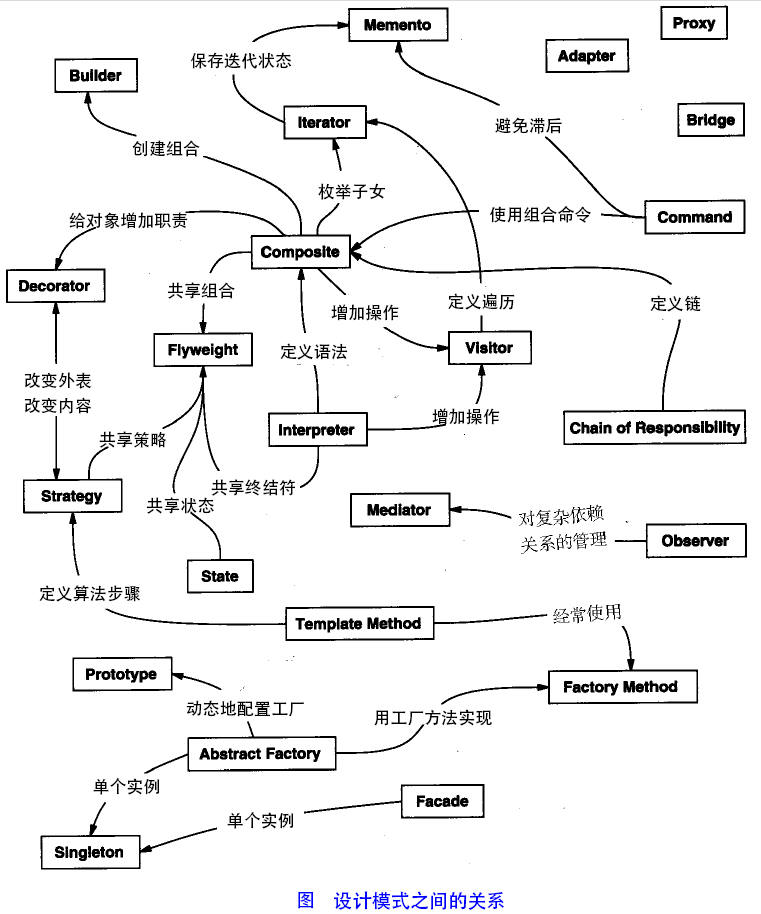

:::tip
本教程将通过.NET 实例，一步一步向您讲解设计模式的概念

:::

<!-- more -->

## 设计模式简介

设计模式是一套被反复使用的、多数人知晓的、经过分类编目的、代码设计经验的总结。使用设计模式是为了重用代码、让代码更容易被他人理解、保证代码可靠性。 毫无疑问，设计模式于己于他人于系统都是多赢的，设计模式使代码编制真正工程化，设计模式是软件工程的基石，如同大厦的一块块砖石一样。项目中合理地运用设计模式可以完美地解决很多问题，每种模式在现实中都有相应的原理来与之对应，每种模式都描述了一个在我们周围不断重复发生的问题，以及该问题的核心解决方案，这也是设计模式能被广泛应用的原因。

## 设计模式的类型

设计模式一共有23种，这些模式可以分为三大类：**创建型模式**、**结构性模式**、**行为型模式**。

还有另一类设计模式：**J2EE 设计模式**。

<table>
    <tr>
        <td style='width:5%'><h3>序号</h3></td>
        <td style='width:65%'><h3>模式&描述</h3></td>
        <td style='width:30%'><h3>设计模式</h3></td>
    </tr>
    <tr>
        <td style='width:5%'>1</td>
        <td style='width:65%'>
         <h3>创建型模式</h3>
         这些设计模式提供了一种在创建对象的同时隐藏创建逻辑的方式，而不是使用 new 运算符直接实例化对象。这使得程序在判断针对某个给定实例需要创建哪些对象时更加灵活。
        </td>
        <td style='width:30%'>
        1. 工厂模式 2. 抽象工厂模式 3. 单例模式 4. 建造者模式 5. 原型模式                                                          
        </td>
    </tr>
    <tr>
        <td style='width:5%'>2</td>
        <td style='width:65%'>
        <h3>结构型模式</h3>
         这些设计模式提供了一种在创建对象的同时隐藏创建逻辑的方式，而不是使用 new 运算符直接实例化对象。这使得程序在判断针对某个给定实例需要创建哪些对象时更加灵活。
        </td>
        <td style='width:30%'>
        1. 适配器模式 2. 桥接模式 3. 过滤器模式 4. 组合模式 5. 装饰器模式 6. 外观模式 7. 享元模式 8. 代理模式 
        </td>
    </tr>
    <tr>
        <td style='width:5%'>3</td>
        <td style='width:65%'>
        <h3>行为型模式</h3>
         这些设计模式提供了一种在创建对象的同时隐藏创建逻辑的方式，而不是使用 new 运算符直接实例化对象。这使得程序在判断针对某个给定实例需要创建哪些对象时更加灵活。
        </td>
        <td style='width:30%'>
        1. 责任链模式 2. 命令模式 3. 解释器模式 4. 迭代器模式 5. 中介者模式 6. 备忘录模式 7. 观察者模式 8. 状态模式 9. 空对象模式 10. 策略模式 11. 模板模式 12. 访问者模式
        </td>
    </tr>
    <tr>
      <td style='width:5%'>4</td>
      <td style='width:65%'>
      <h3>J2EE 模式</h3>
        这些设计模式提供了一种在创建对象的同时隐藏创建逻辑的方式，而不是使用 new 运算符直接实例化对象。这使得程序在判断针对某个给定实例需要创建哪些对象时更加灵活。
      </td>
      <td style='width:30%'>
      1. MVC模式 2. 业务代表模式 3. 组合实体模式 4. 数据访问对象模式 5. 前端控制器模式 6. 拦截过滤器模式 7. 服务定位模式 8. 传输对象模式
      </td>
    </tr>
</table>

下面用一张图片来整体描述一下设计模式之间的关系：

## 设计模式的六大原则

1. **开闭原则**
   
   开闭原则的意思是： **对扩展开放，对修改关闭** 。在程序需要进行拓展的时候，不能去修改原有的代码，实现一个热插拔的效果。简言之，是为了使程序的扩展性好，易于维护和升级。想要达到这样的效果，我们需要使用接口和抽象类，后面的具体设计中我们会提到这点。
2. **里氏替换原则**
   
   里氏替换原则是面向对象设计的基本原则之一。 里氏替换原则中说，任何基类可以出现的地方，子类一定可以出现。里氏替换原则是继承复用的基石，只有当派生类可以替换掉基类，且软件单位的功能不受到影响时，基类才能真正被复用，而派生类也能够在基类的基础上增加新的行为。里氏代换原则是对开闭原则的补充。实现开闭原则的关键步骤就是抽象化，而基类与子类的继承关系就是抽象化的具体实现，所以里氏替换原则是对实现抽象化的具体步骤的规范。
3. **依赖倒置原则**
   
   这个原则是开闭原则的基础，具体内容：针对接口编程，依赖于抽象而不依赖于具体。
4. **接口隔离原则**
   
   这个原则的意思是：使用多个隔离的接口，比使用单个接口要好。它还有另外一个意思是：降低类之间的耦合度。由此可见，其实设计模式就是从大型软件架构出发、便于升级和维护的软件设计思想，它强调降低依赖，降低耦合。
5. **迪米特法则(最少知道原则)**
   
   最少知道原则是指：一个实体应当尽量少地与其他实体之间发生相互作用，使得系统功能模块相对独立。
6. **合成复用原则**
   
   合成复用原则是指：尽量使用合成/聚合的方式，而不是使用继承。
