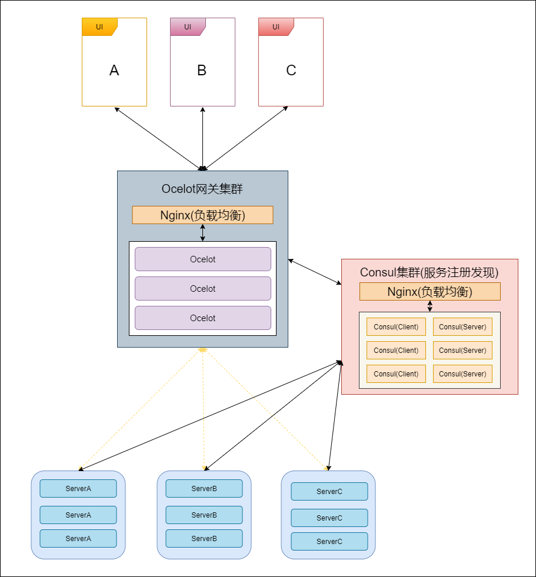

:::tip
基于Docker、Nginx、Consul、Ocelot等，从零开始搭建一套具有动态伸缩、限流、熔断的简易微服务架构。
:::

<!-- more -->


## 目标



## 环境说明

* 本文适合有一定linux基础，并对容器、集群、负载均衡、服务注册与发现、网关等概念有一定了解的同学。
* 本文中默认各服务集群部署在不同的Linux服务器(下文用Linux1...2...3...代指)，环境所需的多台服务器可用虚拟机代替。
* 由于在该架构中，服务端在启动时会想Consul注册中心发起注册，所以我们需要先进行Consul集群的搭建。

## 1 Consul注册中心集群搭建(Linux1)

### 1.1 拉取Consul镜像

```shell
docker pull consul
```

### 1.2 配置第一个Consul

```shell
docker run -d --name consul1 --restart=always \
-e 'CONSUL_LOCAL_CONFIG={"skip_leave_on_interrupt":true}' \
-p 8500:8500 -p 8300:8300 -p 8301:8301/udp -p 8302:8302/udp -p 8600:8600 \
consul agent -server -bootstrap-expect=2 -ui -bind=0.0.0.0 -client 0.0.0.0 \
-data-dir=/consul/data-dir \
-node=nodes1
```

> **参数说明：**
>
> **8500 http 端口，用于 http 接口和 Web ui**
>
> **8300 server rpc 端口，同一数据中心 consul server 之间通过该端口通信**
>
> **8301 serf lan 端口，同一数据中心 consul client 通过该端口通信**
>
> **8302 serf wan 端口，不同数据中心 consul server 通过该端口通信**
>
> **8600 dns 端口，用于服务发现**
>
> **-server 以server模式启动，默认为client模式启动**
>
> **-bootstrap-expect 2：集群至少两台服务器，才能选举集群 leader，数目一达到，它就会被激活**
>
> **-ui：运行 Web 控制台**
>
> **-bind：监听网口，0.0.0.0 表示所有网口，如果不指定默认未 127.0.0.1，则无法和容器通信**
>
> **-client：限制某些网口可以访问**
>
> **-node：节点名称，节点中必须是唯一的**

**默认Consule面板地址：[服务器IP]:8500**

**查看node1情况 (正常输出：Consul agent running!)**

```shell
docker logs -f consul1
```

**获取 Consul Server 1 的 ip 地址 (默认：172.17.0.2)**

```shell
docker exec consul1 consul members
```

### 1.3 启动第二个Consul服务

```
docker run -d --name consul2 --restart=always \
-e 'CONSUL_LOCAL_CONFIG={"skip_leave_on_interrupt":true}' \
 -p 8501:8500 \
consul agent -server -bootstrap-expect=2 -ui -bind=0.0.0.0 -client 0.0.0.0 \
-data-dir=/consul/data-dir \
-node=nodes2 \
-join 172.17.0.2
```

> **参数说明：**
>
> **-join join其他Consul服务的ip可组成集群**

### 1.4 启动其余4个Consul服务

```
docker run -d --name consul3 --restart=always \
-e 'CONSUL_LOCAL_CONFIG={"skip_leave_on_interrupt":true}' \
 -p 8502:8500 \
consul agent -server -bootstrap-expect=2 -ui -bind=0.0.0.0 -client 0.0.0.0 \
-data-dir=/consul/data-dir \
-node=nodes3 \
-join 172.17.0.2
```

```
docker run -d --name=consul4 --restart=always \
-e 'CONSUL_LOCAL_CONFIG={"skip_leave_on_interrupt":true}' \
 -p 8503:8500 \
consul agent -ui -bind=0.0.0.0 -client 0.0.0.0 \
-node=nodec1 \
-retry-join=172.17.0.2
```

```
docker run -d --name=consul5 --restart=always \
-e 'CONSUL_LOCAL_CONFIG={"skip_leave_on_interrupt":true}' \
 -p 8504:8500 \
consul agent -ui -bind=0.0.0.0 -client 0.0.0.0 \
-node=nodec2 \
-retry-join=172.17.0.2
```

```
docker run -d --name=consul6 --restart=always \
-e 'CONSUL_LOCAL_CONFIG={"skip_leave_on_interrupt":true}' \
 -p 8505:8500 \
consul agent -ui -bind=0.0.0.0 -client 0.0.0.0 \
-node=nodec3 \
-retry-join=172.17.0.2
```

此时Consul 集群已完成部署，可以浏览器访问：http://ip:8500 | 8501 | 8502 查看状态（"|"=或者）

**查看节点**

```shell
docker exec -t consul1 consul members
```

**查看主从信息**

```shell
docker exec -t consul1 consul operator raft list-peers
```

## 2 为Consul集群配置Nginx负载均衡(Linux2)

### 2.1 拉取镜像

```shell
docker pull nginx
```

### 2.2 启动Nginx服务

```shell
docker run --name nginx -p 80:80 -d --restart=always nginx
```

### 2.3 修改配置文件

**进入容器：**

```shell
docker exec -it nginx bash
```

**配置文件地址：/etc/nginx/nginx.conf**

```shell
vi /etc/nginx/nginx.conf 
```

**若vi或者vim命令无法使用，则需先执行以下命令：**

```shell
apt-get  update
apt-get install vim -y
```

**在默认配置文件http节点下加入以下代码并保存：**

```shell
#upstream 轮询模式 consul 名称，可自定义
#server 后为consul地址

upstream consul{
server IP:8500;
server IP:8501;
server IP:8502;
server IP:8503;
server IP:8504;
server IP:8505;
}

#该服务器接受到端口80的所有流量并将其传递给上游upstream 。
#请注意，upstream名称和proxy_pass需要匹配。

server {
listen 80;
server_name localhost;
location / {
proxy_pass http://consul;
}
}

注释掉 默认配置文件中的 /include /etc/nginx/conf.d/*.conf
不然会导致配置不生效
```

### 2.4 重启Nginx服务

**退出镜像**

```shell
exit
```

**重启Nginx服务**

```shell
docker restart nginx
```

## 3 API服务端搭建(Linux3)

### 3.1准备.Net Core Web Api 作为测试服务端

相相关代码可参考我已经写好的测试项目：[ServerTest](https://gitee.com/goodsxx/server-test)

### 3.2 上传项目至Linux3

**将WebApi项目上传至linux的test/weifuwu目录下**

**进入项目根目录：**

```shell
cd /test/weifuwu/ServerTest
```

**构建镜像：**

```shell
docker build -t dotnet -f Dockerfile .
```

**查看镜像：**

```shell
docker images
```

**以此镜像为模板启动多个容器：**

```
docker run --restart=always -idt -p 2300:80 dotnet --ip=*.*.*.26 --port=2300 --name=ServerA
docker run --restart=always -idt -p 2301:80 dotnet --ip=*.*.*.26 --port=2301 --name=ServerA
docker run --restart=always -idt -p 2302:80 dotnet --ip=*.*.*.26 --port=2302 --name=ServerA

docker run --restart=always -idt -p 2303:80 dotnet --ip=*.*.*.26 --port=2303 --name=ServerB
docker run --restart=always -idt -p 2304:80 dotnet --ip=*.*.*.26 --port=2304 --name=ServerB
docker run --restart=always -idt -p 2305:80 dotnet --ip=*.*.*.26 --port=2305 --name=ServerB

docker run --restart=always -idt -p 2306:80 dotnet --ip=*.*.*.26 --port=2306 --name=ServerC
docker run --restart=always -idt -p 2307:80 dotnet --ip=*.*.*.26 --port=2307 --name=ServerC
docker run --restart=always -idt -p 2308:80 dotnet --ip=*.*.*.26 --port=2308 --name=ServerC

```

## 4 Ocelot网关集群搭建(Linux4)

### 4.1准备.Net Core Web Api 测试项目

相相关代码可参考我已经写好的测试项目：[OcelotTest](https://gitee.com/goodsxx/ocelot-test)

### 4.2 上传项目至Linux服务器

**将WebApi项目上传至linux的test/weifuwu目录下**

**进入项目根目录：**

```shell
cd /test/weifuwu/OcelotTest
```

**构建镜像：**

```shell
docker build -t ocelot -f Dockerfile .
```

**查看镜像：**

```shell
docker images
```

**以此镜像为模板启动多个容器：**

```
docker run --restart=always -idt -p 801:80 ocelot
docker run --restart=always -idt -p 802:80 ocelot
docker run --restart=always -idt -p 803:80 ocelot

```

## 5 为Ocelot集群配置Nginx负载均衡(Linux4)

### 5.1 拉取镜像

```shell
docker pull nginx
```

### 5.2 启动Nginx服务

```shell
docker run --name nginx -p 80:80 -d --restart=always nginx
```

### 5.3 修改配置文件

**进入容器：**

```shell
docker exec -it nginx bash
```

**配置文件地址：/etc/nginx/nginx.conf**

```shell
vi /etc/nginx/nginx.conf 
```

**若vi或者vim命令无法使用，则需先执行以下命令：**

```shell
apt-get  update
apt-get install vim -y
```

**在默认配置文件http节点下加入以下代码并保存：**

```shell
#upstream 轮询模式 ocelot 名称，可自定义
#server 后为ocelot地址

upstream ocelot{
server *.*.*.26:801;
server *.*.*.26:802;
server *.*.*.26:803;
}

#该服务器接受到端口80的所有流量并将其传递给上游upstream 。
#请注意，upstream名称和proxy_pass需要匹配。

server {
listen 80;
server_name localhost;
location / {
proxy_pass http://ocelot;
}
}

#注释掉 默认配置文件中的 /include /etc/nginx/conf.d/*.conf
#不然会导致配置不生效
```

### 5.4 重启Nginx服务

**退出镜像**

```shell
exit
```

**重启Nginx服务**

```shell
docker restart nginx
```

## 6 Web客户端搭建(Linux6)

### 6.1 准备.Net Core Web(MVC)测试项目

相相关代码可参考我已经写好的测试项目：[WebTest](https://gitee.com/goodsxx/web-test)

### 6.2 上传项目至Linux6

**将WebApi项目上传至linux的test/weifuwu目录下**

**进入项目根目录：**

```shell
cd /test/weifuwu/WebTest
```

**构建镜像：**

```shell
docker build -t web -f Dockerfile .
```

**查看镜像：**

```shell
docker images
```

**以此镜像为模板启动容器：**

```shell
docker run --restart=always -idt -p 80:80 web
```

## 大功告成

效果：

1. 刷新页面，客户端调用的服务端IP会变化
2. 当关闭/新增一个服务端的时候，服务注册发现生效，客户端并不会报错
3. 多次刷新页面会出发限流效果，提示请稍后
